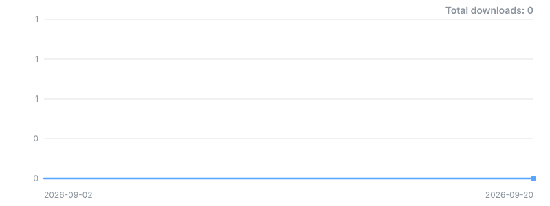

# limbic

[](https://www.npmjs.com/package/limbic)
[](https://github.com/Redrum624/limbic/releases)
[](https://github.com/Redrum624/limbic/releases/latest)


> **limbic** — *the brain circuitry where emotion and memory meet.*

**A portable memory engine for LLM agents.** limbic gives an agent a memory that
behaves like one: importance-weighted scoring, per-category forgetting curves,
emotional salience, retrieval that refuses to return five paraphrases of the
same fact, and LLM extraction of new memories from conversation. It is a
TypeScript port of the memory subsystem of a private production engine by the
same author ("the origin engine"), and the port is proved rather than claimed:
cross-language golden fixtures pin the scoring and the diversity selection, and
the suite re-verifies them on every run.

Every TypeScript memory option today is either a cloud-service client, a
framework store with no memory model (namespace/key JSON with get/put/search),
or an engine whose defaults phone home to a hosted embedding API. limbic is the
other thing: **local-first, LLM-agnostic, zero required runtime dependencies.**
The only network call it can make is to an Ollama host *you* configure; the only
LLM it can call is the `complete` function *you* inject. There is no telemetry
and no default cloud provider.

## Why limbic

- **Zero required runtime dependencies.** `better-sqlite3`, `node-llama-cpp` and
  `@huggingface/transformers` are optional peers behind dynamic `import()`, each
  absence reported with an install hint, never a crash at module load.
- **A real memory model.** Four-channel scoring (recency, importance, relevance,
  emotion), half-life decay per category with importance floors, and GIST
  diversity selection (arXiv:2405.18754) — not a similarity top-`k` with extra
  steps.
- **Parity is measured, not asserted.** All 22 of divsel's golden diversity
  cases pass with *exact* numeric agreement; the origin engine's scoring fixture
  passes at its own absolute `1e-6`; four deliberate rule mutations are graded
  in-repo and reproduce the reference's published failure counts. See
  [Parity](#parity).
- **Nothing at the edges is fatal.** An embedder that is down costs the cosine
  channel, not the write and not the turn. Diversity that throws degrades to
  top-`k` by score.
- **Lifecycle-complete.** `limbic.close()` releases whatever the engine holds —
  the SQLite handle, a loaded GGUF model, an ONNX session — and is idempotent.
- **Dual ESM/CJS**, types for both, strict TypeScript with
  `noUncheckedIndexedAccess`, Node ≥ 22.

## Install

```sh
npm i limbic
```

Node ≥ 22, zero required dependencies. The optional peers, each unlocking one
feature:

```sh
npm i better-sqlite3               # + SQLite persistence (SqliteStore)
npm i node-llama-cpp               # + in-process GGUF embeddings
npm i @huggingface/transformers    # + transformers.js embeddings
```

### From a checkout

```sh
git clone https://github.com/Redrum624/limbic.git
cd limbic
npm ci        # installs dev deps; the prepare script builds dist/ for you
npm test      # 311 passing
```

Consume a checkout from another project in any of the usual ways — the `prepare`
script means all three produce a built `dist/`:

```sh
npm i /path/to/limbic                # path dependency (dist/ built by npm ci above)
npm pack /path/to/limbic && npm i limbic-0.1.0.tgz   # tarball
npm i github:Redrum624/limbic        # git dependency; npm runs prepare in a temp clone
```

## Quickstart

### Pure in-memory — no dependencies at all

```ts
import { createLimbic } from "limbic";

const limbic = createLimbic();

await limbic.remember("User's name is Ada", { category: "personal_fact", importance: 0.9 });
await limbic.remember("User is allergic to shellfish", { category: "health", importance: 0.95 });

const hits = await limbic.retrieve("what should I avoid cooking?", 3);
// [{ memory: { content: "User is allergic to shellfish", ... }, score: 0.5825 }, ...]
```

That runs with no model, no network and nothing on disk, and the `0.5825` is
what the snippet actually returns (verified against the built package,
2026-09-02): with no embedder the cosine channel is **MISSING** — which is not
the same as a similarity of `0`, and is handled as such throughout — so the
score is `0.25 × recency + 0.35 × importance` with a relevance and emotion
channel of zero.

### With an embedder

```ts
import { OllamaEmbedder, createLimbic } from "limbic";

const limbic = createLimbic({
  embedder: new OllamaEmbedder({ host: "http://127.0.0.1:11434", model: "nomic-embed-text" }),
});
```

`OllamaEmbedder` POSTs `{ model, input }` to `{host}/api/embed` and reads
`json.embeddings`; the legacy `/api/embeddings` is deliberately unsupported.
Prefer the IPv4 literal over `localhost`: on a dual-stack host where Ollama
binds IPv4 only, Node's resolver can hand back `::1`. Or fully in-process, no
server at all:

```ts
import { TransformersEmbedder, createLimbic } from "limbic";

const limbic = createLimbic({ embedder: new TransformersEmbedder() });
```

```ts
import { NodeLlamaCppEmbedder, SqliteStore, createLimbic } from "limbic";

const limbic = createLimbic({
  store: await SqliteStore.open("./memories.db"),
  embedder: new NodeLlamaCppEmbedder({ modelPath: "/models/nomic-embed-text-v1.5.Q4_K_M.gguf" }),
});
// ...
await limbic.close();   // releases the SQLite handle and the loaded model
```

Full scripts: [`examples/ollama-companion.ts`](examples/ollama-companion.ts) and
[`examples/node-llama-cpp.ts`](examples/node-llama-cpp.ts) (run with
`npx tsx examples/<name>.ts` — `tsx` is fetched by npx, it is not a
devDependency).

### Extraction needs a `complete`

```ts
const limbic = createLimbic({
  // Your LLM call. limbic ships no provider SDK and never will.
  complete: async (prompt) => callYourModel(prompt),
});
const extracted = await limbic.extract(conversation);   // throws without a complete
```

The extractor's output is untrusted model text: it is parsed defensively and
`importance`/`confidence` are clamped, but review what you `remember()` from it.
A user turn can steer what the model extracts — that is inherent to LLM
extraction and documented in `src/extraction.ts`.

## API

### `createLimbic(options?)`

| Option | Default | Meaning |
|---|---|---|
| `store` | `new MemStore()` | Any `MemoryStore`. `SqliteStore` is built in behind an optional peer. |
| `embedder` | none | Any `Embedder`. Absent means keyword-only scoring and no vectors stored. |
| `complete` | none | Any `CompleteFn`. Absent means `extract()` **throws** rather than silently returning `[]`. |
| `weights` | `DEFAULT_WEIGHTS` | `{ recency: 0.25, importance: 0.35, relevance: 0.25, emotion: 0.15 }` |
| `lambda` | `0.5` | GIST's diversity weight. divsel's own default is `1.0` — see the bench. |
| `pool` | `50` | How many scored rows to diversify over. |

Returns a `Limbic` handle: `remember` / `extract` / `retrieve` / `decayPass` /
`close` / `store`.

### Exports, exhaustively

Everything `import { ... } from "limbic"` can name, grouped as `src/index.ts`
groups them. Types are marked *(type)*.

**Engine** (`src/index.ts`)

| Name | What it is |
|---|---|
| `createLimbic` | Build an engine from the options above. |
| `Limbic` *(type)* | The handle: `remember`, `extract`, `retrieve`, `decayPass`, `close`, `store`. |
| `LimbicOptions` *(type)* | What `createLimbic` accepts. |
| `FADE_THRESHOLD` | `0.05` — below this strength `decayPass` deletes the row. |

**Core types** (`src/types.ts`)

| Name | What it is |
|---|---|
| `Memory` *(type)* | The stored record: content, category, importance, keywords, timestamps, optional embedding and emotion. |
| `ExtractedMemory` *(type)* | What the extractor emits before anything is saved. |
| `MemoryCategory` *(type)* | The category union (`personal_fact`, `health`, …) — open to unknown strings. |
| `MemoryEmotion` *(type)* | `{ label, intensity }` — the pair the emotion channel scores. |
| `Embedder` *(type)* | `{ model, embed(texts) => Float32Array[] }` — the seam every embedder fills. |
| `CompleteFn` *(type)* | `(prompt, opts?) => Promise<string>` — your LLM. |
| `ScoreWeights` *(type)* | The four channel weights. |
| `DEFAULT_WEIGHTS` | `{ recency: 0.25, importance: 0.35, relevance: 0.25, emotion: 0.15 }`. |
| `EMBED_BLEND` | `0.3` — the cosine share of the final score when both vectors exist. |

**Stores** (`src/store.ts`, `src/stores/sqlite.ts`)

| Name | What it is |
|---|---|
| `MemoryStore` *(type)* | The store seam: `save`, `get`, `all`, `search`, `delete`, `updateAccess`, `count`. |
| `MemStore` | The zero-dependency in-memory default. Unbounded until you schedule `decayPass`. |
| `SqliteStore` | SQLite persistence behind the `better-sqlite3` peer; `open()`, `close()`, streaming `decayCandidates()`. |
| `MISSING_SQLITE_PEER` | The install-hint message thrown when the peer is absent. |
| `DEFAULT_ALL_LIMIT` | `200` — `all()`'s default row cap. |
| `DecayCandidate` *(type)* | The scalar slice of a row `decayPass` reads (no embedding materialised). |

**Scoring** (`src/internal/scoring.ts`)

| Name | What it is |
|---|---|
| `scoreMemory` | `(memory, query: ScoreQuery, now, weights?) => number` — the one-number score. Takes `now` explicitly; never reads the wall clock. |
| `scoreMemoryDetailed` | Same, returning the per-channel `ScoreBreakdown`. |
| `ScoreQuery` *(type)* | `{ keywords, embedding?, targetEmotion? }` — not a bare string. |
| `ScoreBreakdown` *(type)* | The four channels, the base, the blend, the final. |
| `RECENCY_HALF_LIFE_DAYS` | `7` — recency halves weekly. |
| `EMOTION_HIGH_THRESHOLD` | `0.7` — intensity at or above it earns the full `+0.5` emotion bonus. |
| `EMOTION_MEDIUM_THRESHOLD` | `0.4` — at or above it, `+0.3`; below, `intensity × 0.3`. |

**Decay** (`src/decay.ts`)

| Name | What it is |
|---|---|
| `calculateDecay` | `(DecayArgs) => number` — strength after decay, rounded half-to-even at 3 dp (Python's `round`). |
| `DecayArgs` *(type)* | `{ originalStrength, daysSinceCreation, daysSinceAccess, importance, category, accessCount }`. |
| `CATEGORY_HALF_LIFE_DAYS` | Per-category half-lives: `relationship` 365 d down to `emotion`/`work` 30 d. |
| `DEFAULT_HALF_LIFE_DAYS` | `60` — for a category not in the table. |
| `IMPORTANCE_DECAY_FACTOR` | Threshold/factor pairs stretching or shrinking the half-life by importance. |
| `ACCESS_REINFORCEMENT_DAYS` | `5` — days of half-life added per **recorded** access (see [Decay](#decay)). |
| `STRENGTH_FLOOR_HIGH` | `0.3` — a memory at importance ≥ 0.8 never falls below this. |
| `STRENGTH_FLOOR_MEDIUM` | `0.1` — the floor at importance ≥ 0.6. |

**Retrieval** (`src/retrieve.ts`)

| Name | What it is |
|---|---|
| `retrieve` | Score the pool, then diversify it. May return fewer than `k` — see below. |
| `scorePool` | Score every candidate row; sorted by score. |
| `diversify` | Run GIST over an already-sorted pool; membership changes, order never does. |
| `RetrieveOptions` *(type)* | Per-call overrides: `pool`, `lambda`, `weights`, `embedder`, `targetEmotion`, `now`, `diversify`. |
| `ScoredMemory` *(type)* | `{ memory, score }`. |
| `DEFAULT_LAMBDA` | `0.5`. |
| `DEFAULT_POOL` | `50`. |

**Diversity** (`src/diversity.ts`)

| Name | What it is |
|---|---|
| `gistSelect` | GIST selection, ids in, ids out. |
| `gistSelectFull` | The full result: indices plus `f`, `g`, `div`, `threshold`, `stage`, `dMax`. |
| `GistSelectOptions` *(type)* | `{ metric?, utility?, exhaustiveThresholds?, diameter?, diameterSweeps? }`. |
| `GistResult` *(type)* | What `gistSelectFull` returns. |
| `Metric` / `UtilityKind` / `Utilities` / `DiameterMode` / `Stage` *(types)* | The contract's enums: both metrics, `linear` / `coverage` / `facility_location`, exact and approximate diameter. |
| `DiversityError` / `DiversityErrorCode` *(type)* | Typed failures; `retrieve` catches them and degrades to top-`k`. |
| `F32_EPSILON` | `1.1920928955078125e-7` — the `f32` machine epsilon the kernel is pinned to. |

**Extraction** (`src/extraction.ts`)

| Name | What it is |
|---|---|
| `extractFromConversation` | `(complete, conversation) => ExtractedMemory[]` — window, prompt, parse, gate. |
| `buildExtractionPrompt` | The prompt for a conversation, or `null` when it is too short to bother. |
| `formatConversation` | The fenced, delimited transcript block spliced into the prompt. |
| `parseExtractionResponse` | Defensive JSON parse of model output; clamps `importance` to `[0, 1]`. |
| `passesSaveGate` | `importance >= 0.4 && confidence >= 0.6`. |
| `categoryFor` | Extraction type → `MemoryCategory`; unknown types map to `general`, not dropped. |
| `EXTRACTION_PROMPT` | The default prompt. Yours to replace. |
| `EXTRACTION_TO_CATEGORY` | The type→category table behind `categoryFor`. |
| `KNOWN_EXTRACTION_TYPES` | The set the origin engine recognises. |
| `CONVERSATION_WINDOW` | `10` — turns considered. |
| `MIN_CONVERSATION_CHARS` | `50` — below this, no extraction call at all. |
| `MIN_IMPORTANCE` / `MIN_CONFIDENCE` | `0.4` / `0.6` — the save gate's two halves. |
| `ChatTurn` *(type)* | `{ role, content }`. |

**Embedders** (`src/embedders/`)

| Name | What it is |
|---|---|
| `OllamaEmbedder` / `OllamaEmbedderOptions` *(type)* | POST `/api/embed` with a bounded timeout; host validated at construction. |
| `DEFAULT_OLLAMA_HOST` | `http://127.0.0.1:11434`. |
| `NodeLlamaCppEmbedder` / `NodeLlamaCppEmbedderOptions` *(type)* | In-process GGUF embeddings; `dispose()` frees the model and context. |
| `TransformersEmbedder` / `TransformersEmbedderOptions` *(type)* | transformers.js embeddings; `dispose()` releases the ONNX session. |
| `EmbedderUnavailableError` | Thrown when a peer is missing or a host is unreachable — with the install hint. |
| `isEmbedderUnavailable` | Type guard for the above. |

### Scoring

```
recency   = 0.5 ^ (daysSinceLastAccess / 7)
base      = clamp(0.25*recency + 0.35*importance + 0.25*relevance + 0.15*emotion, 0, 1)
final     = base                                          (no comparable vector)
final     = clamp(0.70*base + 0.30*max(0, cosine), 0, 1)  (both vectors present)
```

`cosine == null` means **MISSING**, never `0.0` — a port that substituted `0.0`
would fail the scoring fixture.

### Decay

`calculateDecay` applies per-category half-lives, an importance factor that
stretches or shrinks the half-life, and floors so that a memory at
importance ≥ 0.8 never falls below 0.3. `decayPass()` walks the store —
streaming scalar slices when the store supports it, so no embedding BLOBs are
materialised — deletes anything below `FADE_THRESHOLD = 0.05`, and reports
`{ decayed, faded }`. Schedule it yourself; nothing in the engine runs it for
you, and `MemStore` grows until something does.

**Reinforcement is the caller's contract.** Each *recorded* access adds
`ACCESS_REINFORCEMENT_DAYS = 5` days of half-life — but nothing in the engine
records one. `retrieve()` reads rows; it does not touch `accessCount` or
`lastAccessed`. A hit reinforces a memory only if you call
`store.updateAccess(id)` for the hits you actually use. Skip that and every
memory decays as if it were never read.

### Retrieval and diversity

`retrieve` scores the pool, then hands the rows that carry a vector to GIST
(arXiv:2405.18754v3), maximising `g(S) + lambda * div(S)`. Three properties are
load-bearing, and each has a test that fails if it breaks:

1. **Diversity changes membership, never order.** The pool is sorted by score,
   so a position in it *is* its rank; the result is assembled by index.
2. **A memory with no embedding is selectable but edge-free.** It can take a
   slot GIST left open and cannot lower the spread.
3. **The fill never re-admits what the selector rejected.** So `retrieve` can
   return **fewer than `k`** rows. That short return is a signal, not a bug: it
   means `lambda` is too high for this corpus.

## Parity

limbic does not claim to behave "like" its references; it reproduces their
committed fixtures, and the suite re-hashes both fixtures on every run
(`test/fixtures.hash.test.ts`) so a silent edit fails loudly. Full provenance,
hashes and the one documented metadata exception:
[`test/fixtures/PROVENANCE.md`](test/fixtures/PROVENANCE.md).

### Diversity — divsel's `golden-selection.json`

| | |
|---|---|
| Fixture | 22 cases, schema 1, generator `divsel 0.1.0`, copied byte-for-byte (`sha256 73713cd2…`) |
| Rules | divsel `docs/CONFORMANCE.md`, `sha256 829bc087…` (commit `02c546f` on divsel's current `main`) |
| Cases passing | **22 of 22 — none skipped**, case 20 (approximate diameter, the only optional case) included |
| Scope | both metrics, all three utilities (`linear`, `coverage`, `facility_location`), exhaustive thresholds, approximate diameter |
| Numeric agreement | **exact** — worst tolerance-budget share across all 22 cases × 5 numeric fields is **0** |

That last row is not a rounding claim. divsel computes every distance in `f32`
with a fixed 16-accumulator reduction order, and `src/internal/gist.ts`
reproduces that kernel with `Math.fround` rather than computing in `f64`, so the
two agree bit-for-bit instead of merely within `1e-6`. The suite asserts it,
gated at 0.1% of each field's tolerance budget.

The tolerance rules are the current ones: divsel's earlier blanket bound was
measured (by divsel) to fail correct ports 69 times by up to 8.1×, and was
replaced by a per-primitive `tol(x)`, with `expected_f` bounded as
`tol(expected_g) + lam*tol(expected_div)` because `f = g + lam*div` is derived.

And the reader is not vacuous — that is measured *in this repo*, not quoted.
`test/diversity.golden.test.ts` builds a driver clone proved field-identical to
`gistSelectFull` on all 22 cases, injects four deliberate rule mutations, and
asserts the failure counts CONFORMANCE.md publishes:

| Mutation | limbic measures | CONFORMANCE.md says |
|---|---|---|
| strict `>` in the sweep fold (rule 2) | 15 of 22 | 15 |
| argmax ties to the highest index (rule 1) | 9 of 22 | nine |
| `lambda` doubled | 20 of 22 | 20 |
| `div(\|S\| ≤ 1) = 0` instead of `d_max` (rule 4) | case 7 alone | case 7 |

> **`lambda` defaults to `0.5` in limbic**, matching the origin engine's
> default. **divsel's own default is `1.0`.** The bench below shows the
> crossover sitting between them on a clustered corpus, so limbic's default is
> the conservative one: it diversifies less, not more.

### Scoring — the origin engine's `golden-scoring.json`

Numeric content copied untouched from the origin engine (two metadata strings
neutralised for publication — documented, with hashes, in
[`PROVENANCE.md`](test/fixtures/PROVENANCE.md)); `sha256 89755bf6…` pins the
published bytes. Clock pinned to the fixture's own `now = 2026-08-26T12:00:00`,
asserted at the fixture's own **absolute** `1e-6` on `expected_base_score`,
`expected_final_score` and both ranking arrays. `cosine == null` means
**MISSING**, never `0.0` — a port that substituted `0.0` would fail the
`portuguese` row.

### Deliberate deviations from the origin engine

| limbic | The origin engine | Why |
|---|---|---|
| `id: string` | integer autoincrement | limbic must support non-SQL stores and caller-supplied ids. |
| `extractionType: string` | closed enum | Unknown types map to `general` and are kept; the origin engine drops the row. |
| Prompt placeholder substituted literally | `str.format(...)` | The origin engine's formatting call raises on its own prompt's JSON example and the exception is swallowed, so its LLM extraction path returns `[]` today. limbic replaces the one `{conversation}` token and leaves the example intact. |
| `extract()` never writes | writes through when configured to | `remember()` is the only writer. The save gate travels with the data as `passesSaveGate`. |
| `Memory.emotion?: { label, intensity }` | read from the source conversation | The caller supplies the scored pair; `Memory.feeling` is the extractor's free-text tone and is not what is scored. |
| `scoreMemory(m, q, now)` | reads the wall clock | An explicit clock is what makes the fixture evaluable. |

## Bench

`npm run bench` — 60 memories, 12 planted topics × 5 near-paraphrases each,
dim 48, fixed seed, `k = 8`, clusters counted as connected components at
`cosine > 0.92`.

| strategy | redundancy ↓ | clusters hit | coverage ↑ | facts / 1k prompt chars ↑ |
|---|---|---|---|---|
| naive top-`k` | 0.9794 | 2 / 12 | 0.167 | 3.086 |
| `gistSelect` λ=0 | 0.9794 | 2 / 12 | 0.167 | 3.086 |
| `gistSelect` λ=0.5 *(default)* | 0.9794 | 2 / 12 | 0.167 | 3.086 |
| `gistSelect` λ=1 | **0.1387** | **8 / 12** | **0.667** | **12.346** |
| `gistSelect` λ=2 | 0.1387 | 8 / 12 | 0.667 | 12.346 |
| `gistSelect` λ=4 | 0.1387 | 8 / 12 | 0.667 | 12.346 |
| `gistSelect` λ=8 | 0.1387 | 8 / 12 | 0.667 | 12.346 |

Above the crossover the same eight slots and the same 648 prompt characters
carry **four times the distinct facts**, and redundancy falls from "every pick
has a near-twin" to "almost none does". Cost: a mean **≈3.7 ms** per selection
at this size against **≈80 ns** for a slice (`npm run bench`, 2026-09-02, one
machine — expect drift) — GIST runs `2 + |D|` greedy passes, 32 thresholds at
`eps = 0.1`.

**Read the top three rows as the honest half.** At `λ ≤ 0.5` GIST returns
exactly top-`k` here, and that is *correct*: below the crossover the score given
up to reach another cluster outweighs the diversity gained. Whether `0.5` is
right for your corpus depends on how steep your score gradient is across topics.
Sweep it. And the corpus is **synthetic and n = 1**, built with a cluster
structure chosen to make redundancy visible — treat the table as a mechanism
demo, not a general benchmark.

## Architecture

```
src/
  index.ts            createLimbic — wires the pieces, owns ids and close()
  types.ts            Memory, ExtractedMemory, the seams (Embedder, CompleteFn)
  store.ts            MemoryStore seam + MemStore (zero-dep default)
  stores/sqlite.ts    SqliteStore, behind the better-sqlite3 peer
  retrieve.ts         score the pool -> diversify -> fill, preserving spread
  decay.ts            calculateDecay — half-lives, importance factor, floors
  extraction.ts       prompt, window, defensive parse, save gate
  diversity.ts        the public GIST surface + typed errors
  embedders/          ollama, node-llama-cpp, transformers, shared errors
  internal/           scoring, the f32 GIST kernel, vec ops, store shared bits
```

Everything in `src/internal/` is implementation; the curated re-exports in
`src/index.ts` are the API. One import direction, no cycles: `index` → pipeline
modules → `internal`.

## Development

```sh
npm ci               # install + build dist/ (prepare)
npm test             # vitest — 311 passed | 5 skipped, no network
npm run typecheck    # tsc --noEmit
npm run build        # tsup — ESM + CJS + d.ts/d.cts
npm run bench        # the redundancy bench above

# Live Ollama integration suite — opt-in, off by default and in CI:
LIMBIC_LIVE=1 npx vitest run test/embedders.ollama.live.test.ts
# Optionally LIMBIC_OLLAMA_HOST=http://127.0.0.1:11434 to point it elsewhere.
```

The default suite makes **zero network calls**; the 5 skips are the live suite
declining to run without `LIMBIC_LIVE=1`. Golden fixtures are pinned by sha256
and never hand-edited — see [`CONTRIBUTING.md`](CONTRIBUTING.md).

## Documentation

| File | What is in it |
|---|---|
| [`CHANGELOG.md`](CHANGELOG.md) | What shipped in 0.1.0, and the pre-publication hardening after it |
| [`CONTRIBUTING.md`](CONTRIBUTING.md) | Dev setup, the golden-fixture rule, PR expectations |
| [`test/fixtures/PROVENANCE.md`](test/fixtures/PROVENANCE.md) | Where both fixtures come from, their hashes, and the rules they are read under |
| [`examples/`](examples) | Two runnable end-to-end scripts |
| [`LICENSE`](LICENSE) | Apache-2.0, in full |

## Credits

- **[divsel](https://github.com/Redrum624/divsel)** — the Rust GIST reference
  implementation by the same author. Its golden fixture and CONFORMANCE rules
  are the contract `gistSelect` reproduces.
- **GIST** — the diversity-selection algorithm,
  [arXiv:2405.18754](https://arxiv.org/abs/2405.18754).
- **The origin engine** — a private production engine by the same author; the
  source of the scoring, decay and extraction semantics and of the scoring
  fixture. It stays unnamed here.

The limbic system is the brain circuitry where emotion and memory meet. That is
exactly the scope of this library.

## Downloads



<sub>The curve builds from publish day — the GitHub API keeps no earlier download history.</sub>

## License

Apache-2.0 © 2026 Redrum624.

---

**limbic** — *remembers what matters, forgets what doesn't, and never tells you
the same thing five times.*
